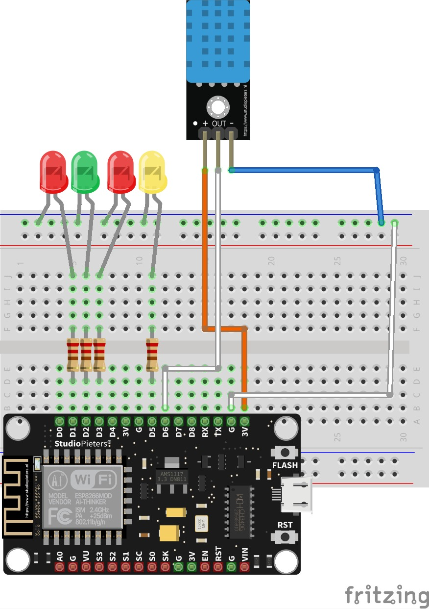
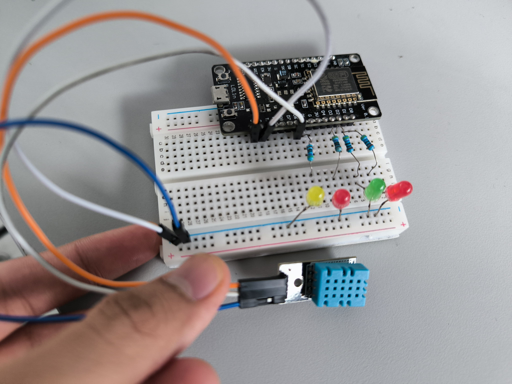

# POSTTEST 4 - PRAKTIUM IOT - UNMUL

Kelompok 1 B 2021 :
- 2109106056 Ahmad Dhiya Ulhaqi
- 2109106078 Rian Syaputra Ainun Naim
- 2109106105 Rhesa Binsar Jeremiah Simbolon

## Project IOT menggunakan Telegram Bot untuk monitoring suhu dan kelembapan serta kontol LED

Perangkat ini dibuat untuk memonitor suhu dan kelembapan ruangan, dilengkapi dengan 3 lampu LED yang dapat dikontrol berdasarkan user + 1 LED yang dapat dikontrol seluruh member grup.

**Cara Kerja Alat :**
- Rangkaian terdiri dari 4 lampu LED (3 dapat dikontrol oleh satu orang dan 1 dapat dikontrol semua orang) dan 1 DHT sensor.
- DHT 11 berfungsi sebagai sensor suhu dan kelembapan untuk membaca suhu ruangan.
- Bot telegram berfungsi sebagai media untuk mengontrol LED dan memonitor rangkaian.
- Bot telegram ditambahkan kedalam satu grup yang terdiri dari seluruh anggota kelompok.
- Seluruh anggota grup bisa mengakses commande yang tersedia pada telegram bot.
- Untuk mengontrol lampu, id pengirim pesan akan diperiksa terlebih dahulu, apabila sesuai dengan id yang ditetapkan pada kodingan barulah lampu dapat menyala ataupun mati.
- Montiring suhu dan kondisi lampu dapat dilakukan oleh seluruh anggota grup, data diambil dari rangkaian kemudian dikirimkan melalui bot telegram.

**Pembagian Tugas :**
- 2109106056 : Algoritma pemrograman.
- 2109106078 : Admin grup, Youtube video, Skematik.
- 2109106105 : Perakitan rangkaian dan pembuatan bot telegram.

**Komponen :**
- BreadBoard
- Resistor
- Kabel male to male dan male to female
- NodeMCU esp8266
- Lampu LED
- DHT 11
- Kabel Micro USB

**Skema :**

**Rangkaian :**

